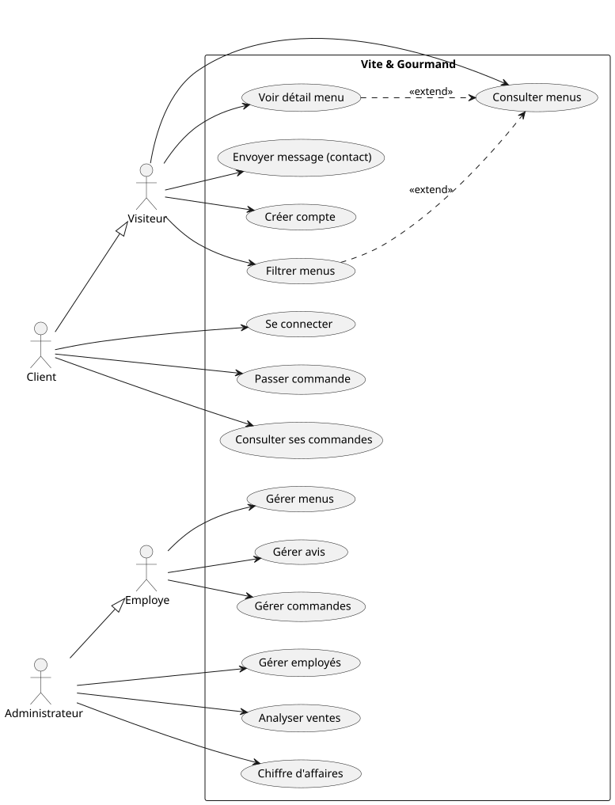

# 03 - Cas d’utilisation

## 1. 🎯 Objectif du système

Le site *Vite & Gourmand* est une application web destinée à un service de traiteur.

Il permet :
- la consultation d’un catalogue de menus et produits
- la passation de commandes en ligne (utilisateurs authentifiés uniquement)
- la prise de contact via un formulaire structuré
- la gestion interne des commandes et du catalogue par le personnel

Le système distingue clairement les utilisateurs publics et les utilisateurs internes.

---

## 2. 👥 Acteurs du système

### 🧑 Visiteur
Utilisateur non authentifié pouvant consulter le site et utiliser le formulaire de contact.

### 👤 Client
Utilisateur authentifié pouvant passer commande et suivre ses commandes.

### 🧑‍💼 Employé
Utilisateur interne chargé du traitement opérationnel des commandes, du catalogue et des demandes issues du formulaire de contact.

### 🧑‍🍳 Administrateur
Utilisateur principal du système disposant de droits étendus de gestion, de supervision et d’analyse.

---

## 3. 🧑 Visiteur

### 📌 Accès au site
Le visiteur peut accéder aux pages suivantes :
- Accueil  
- Menus  
- Contact  
- Connexion / Inscription  
- Mentions légales  
- CGV  

---

### 🍽️ Consultation du catalogue

Le visiteur peut consulter l’ensemble des menus disponibles.

#### Fonctionnalités :
- affichage des menus
- filtrage par :
  - prix
  - thème
  - régime alimentaire
  - nombre de personnes
- consultation du détail d’un menu (données stockées en base de données)

---

### 📞 Formulaire de contact

Le visiteur peut envoyer un message au traiteur via un formulaire de contact.

#### Fonctionnalités :
- titre du message
- message détaillé
- email
- envoi du formulaire

---

### 👤 Création de compte

Le visiteur peut créer un compte client via la page de connexion (email + mot de passe).

---

## 4. 👤 Client

### 🍽️ Accès au site
Le client dispose des mêmes accès que le visiteur.

---

### 🛒 Commandes

Le client peut passer commande.

#### Fonctionnalités :
- accès à la page de commande (authentification obligatoire)
- sélection de menus
- définition du nombre de personnes
- validation de commande

---

### 👤 Espace utilisateur

#### Fonctionnalités :
- consultation des commandes
- suivi des statuts de commande

---

## 5. 🧑‍💼 Employé

### 🧑‍💻 Espace employé
Accès après authentification.

---

### 🍽️ Gestion du catalogue
- ajout de menus / plats
- modification
- suppression
- gestion des horaires

---

### 📦 Gestion des commandes
- consultation des commandes
- filtrage par statut et client
- mise à jour des statuts :
  - acceptée
  - en préparation
  - en cours de livraison
  - livrée
  - en attente de retour de matériel
  - terminée

---

### ⚠️ Annulation de commande
- contact obligatoire avec le client (appel ou email)
- saisie du motif
- indication du mode de contact

---

### 📦 Gestion du matériel prêté
- suivi des retours
- notification client
- pénalités selon CGV

---

### ⭐ Modération des avis
- validation des avis
- refus des avis
- publication des avis validés

---

## 6. 🧑‍🍳 Administrateur

### 👨‍💼 Gestion des employés
- création de comptes employés (email + mot de passe)
- envoi d’un email d’activation
- désactivation de comptes
- impossibilité de créer un administrateur via l’application

---

### 🧑‍💼 Supervision employé
L’administrateur dispose des mêmes droits qu’un employé.

---

### 📊 Analyse des ventes
- nombre de commandes par menu
- comparaison via graphiques
- base de données non relationnelle

---

### 💰 Chiffre d’affaires
- calcul du CA par menu
- filtrage par menu et période

---

## 7. 🧩 Synthèse fonctionnelle

- Visiteur : consultation et contact
- Client : commande et suivi
- Employé : gestion opérationnelle
- Administrateur : supervision et analyse

---

## 8. Diagramme UML

### Note de lecture

Les cas d’utilisation sont représentés à un niveau fonctionnel sans détail technique.

Le diagramme suivant synthétise les cas d'utilisation décrits ci-dessus.

